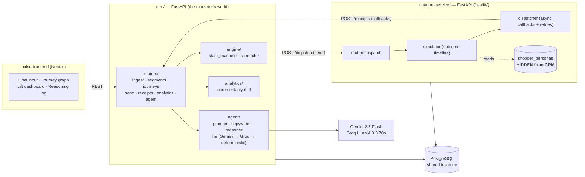

# Pulse — backend

> A self-driving growth agent, packaged as an AI-native mini CRM.

A marketer states a goal in plain language — *"win back customers who stopped buying"* — and
Pulse does the rest: it picks the right shoppers, **designs a multi-step branching journey**,
runs it through a realistic channel service, **holds out a control group to measure true
incremental lift**, and **narrates every decision** so the reasoning is auditable.

This repository (`pulse-backend`) is a small monorepo of **two FastAPI services** that together
form the system. The marketer-facing UI lives in a separate repo (`pulse-frontend`).

---

## The one idea that shapes everything

> **Customer psychology is hidden from the CRM — just like in real life.**

Every simulated shopper has a *persona* (per-channel open propensity, price sensitivity, fatigue
threshold). That persona lives **only inside the channel service** and is never exposed to the
CRM. The agent cannot cheat by reading it — it has to *discover* what works by observing the
callback events that come back from each send. That single constraint is what turns the
simulation into a real test of intelligence instead of a coin flip, and it's why the system is
split into two services rather than one.

---

## Architecture



### The callback loop (the system-design core)

```
CRM /send ─────────────▶ channel-service /dispatch
                                 │  simulator builds an outcome TIMELINE from the
                                 │  HIDDEN persona:
                                 │    t+0.3s delivered
                                 │    t+5s   opened   (p = channel_affinity × (1 − fatigue))
                                 │    t+12s  clicked  (p conditioned on base_buy_propensity)
                                 │    t+30s  converted(p scaled by price_sensitivity if offer)
                                 ▼
                     dispatcher schedules async callbacks (with retries + jitter)
                                 │
  CRM /receipts ◀────────────────┘   (may arrive out of order, may be duplicated)
       │
       ├─ dedup on idempotency_key        (duplicate → no-op)
       ├─ order by sequence / occurred_at
       ├─ append to communication_events  (the source of truth)
       └─ advance communications.status   (FORWARD ONLY: sent<delivered<opened<read<clicked<converted)
```

---

## Repository layout

```
pulse-backend/
├── crm/                          # FastAPI — what the marketer (and agent) can see
│   ├── app/
│   │   ├── main.py               # app + CORS + lifespan-managed scheduler
│   │   ├── db.py · models.py · status.py
│   │   ├── routers/              # ingest, send, receipts, journeys, campaigns, analytics, agent
│   │   ├── agent/                # llm (provider cascade), planner, reasoner
│   │   ├── engine/               # state_machine (journey execution) + scheduler (the loop)
│   │   └── analytics/            # incrementality (treatment − control lift)
│   ├── Dockerfile · requirements.txt · render.yaml · alembic.ini · migrations/
│
├── channel-service/              # FastAPI — "reality": delivery + HIDDEN shopper simulation
│   ├── app/
│   │   ├── main.py · db.py · models.py
│   │   ├── personas / simulator.py   # hidden persona → outcome timeline
│   │   ├── dispatcher.py             # async callbacks back to CRM /receipts
│   │   └── routers/                  # dispatch, seed
│   ├── Dockerfile · requirements.txt · render.yaml · migrations/
│
├── docker-compose.yml            # postgres + crm + channel-service, one command
├── ARCHITECTURE.md               # the full design doc (data model, journey schema, build log)
└── README.md                     # this file
```

`crm` and `channel-service` are **separately deployable** (own Dockerfiles, own `render.yaml`)
but co-located because they are two halves of one tightly-coupled loop.

---

## How the agent plans (and why it's safe)

`agent/planner.py` turns a natural-language goal into an executable campaign via `agent/llm.py`:

1. **Segment** — goal → a structured `filter_json` (validated against a field allowlist).
2. **Journey design** — a `graph_json` state machine drawn from a constrained node vocabulary
   (`split` / `send` / `wait` / `branch` / `END`).
3. **Copy** — message + A/B variants per `send` node.
4. **Adaptation** — after a run, `reasoner.py` reads per-channel lift and proposes the next
   campaign's adjustments (e.g. *"SMS produced −2% lift on segment B — likely fatigue; suppress
   it next time"*).

The provider call is a **cascade** (`query_llm` in `agent/llm.py`):

| Order | Provider | When used |
|---|---|---|
| 1 | **Gemini 2.5 Flash** | always tried first |
| 2 | **Groq LLaMA 3.3 70b** | **only** when Gemini returns a 429/403 quota error |
| 3 | **Deterministic generator** | when no key is set, or both providers fail |

Every step is written to an `agent_decisions` row with a human-readable `reasoning` string and
the `evidence_json` it acted on. The frontend renders these as the "why did the agent do this?"
panel.

> **Safety boundary:** the LLM never executes SQL. It only emits JSON (filter / graph / copy),
> which the code parses (`extract_json`) and validates before anything touches the database.
> This is a deliberate prompt-injection / correctness boundary.

---

## Incrementality (why the numbers are honest)

Naive attribution (`clicked → converted`) overstates impact. Pulse measures *causal* lift using
the control group the `split` node carves out:

```
incremental_lift   = (conversions_treatment / size_treatment) − (conversions_control / size_control)
attributed_revenue = incremental_lift × size_treatment × avg_order_value
```

`analytics/incrementality.py` computes this per campaign / channel / segment, so the dashboard
headlines real incremental orders and revenue, not vanity open rates.

---

## Data model (summary)

**CRM-owned (visible):** `customers`, `orders`, `segments`, `campaigns`, `journeys`,
`journey_enrollments` (incl. `is_control`), `communications`, `communication_events` (with the
unique `idempotency_key`), `agent_decisions`.

**Channel-service-owned (HIDDEN from CRM):** `shopper_personas` — `channel_affinity`,
`price_sensitivity`, `base_buy_propensity`, `fatigue_threshold`, `current_fatigue`.

Full column-level detail and the journey `graph_json` schema are in
[ARCHITECTURE.md](ARCHITECTURE.md).

---

## Reasoning behind every major decision

| Decision | Why | Trade-off / at-scale alternative |
|---|---|---|
| **Two services, one repo** | The CRM and channel service are the two ends of the callback loop; the channel side must hold knowledge the CRM can't see. Co-locating shows cohesion; separate Dockerfiles/`render.yaml` keep the service boundary real. | A true polyrepo or message bus between them. |
| **Hidden personas in the channel service** | Forces the agent to *infer* what works from events instead of reading the answer. This is what makes the simulation an intelligence test. | — (core premise). |
| **In-process async scheduler** (`engine/scheduler.py`, started in the FastAPI lifespan) | A `wait`/`branch` state machine needs a loop that advances enrollees over time; an in-process `asyncio` loop gives that with zero extra infra. A `done`-callback surfaces a crashed loop so it can't silently die. | Redis/Celery/SQS-backed workers for horizontal scale and durability across restarts. |
| **Forward-only status** (`sent<delivered<…<converted`) | Callbacks arrive out of order; a late `delivered` must never overwrite an earlier `clicked`. A rank map makes status monotonic. | Same logic; would live behind a stream processor at scale. |
| **Idempotency key on every event** | Callbacks are retried and can duplicate; a unique constraint makes replays no-ops, so retries are safe. | Identical guarantee with a Redis/SQS dedup table at high volume. |
| **Control-group holdout for lift** | Causal incrementality is the honest metric; click→convert attribution flatters every channel. | Fixed-ratio split now; Thompson-sampling bandit at scale. |
| **LLM emits JSON, never SQL** | Keeps the model on the safe side of a validation boundary (allowlisted fields, constrained node vocabulary) — no arbitrary queries from model output. | — (keep regardless of scale). |
| **Gemini → Groq → deterministic cascade** | Gemini Flash is cheap/fast for the primary path; Groq is a free-tier safety net for quota spikes; the deterministic generator means the product still runs with **no** API key — important for a gradeable demo. | A managed gateway (e.g. provider failover/routing) would centralize this. |
| **PostgreSQL + SQLAlchemy 2.x + Alembic** | One relational store cleanly models customers/orders/events with the constraints (unique idempotency key, FKs) the loop relies on; Alembic keeps schema reproducible. | Same; partition the event log if volume demands. |
| **Render for deploy** | Free web services + a shared managed Postgres host both FastAPI services and the keep-alive cron with minimal config (`render.yaml` per service). | Any container host; the services are plain Docker images. |
| **FastAPI + Pydantic + httpx** | Async-native (matches the scheduler + async callbacks), typed request/response, no heavyweight framework. | — |

---

## Run locally

```bash
# 1. Bring up postgres + both services
docker-compose up --build

# 2. Seed ~500 shoppers + orders (CRM) and their hidden personas (channel service)
curl -X POST http://localhost:8000/ingest/seed      # CRM
curl -X POST http://localhost:8001/seed             # channel-service personas

# 3. Health checks
curl http://localhost:8000/health
```

### Environment variables

| Variable | Service | Purpose | Default |
|---|---|---|---|
| `DATABASE_URL` | both | Postgres connection (`postgres://` is normalized to `postgresql://`) | — |
| `GEMINI_API_KEY` | crm | primary LLM; unset → deterministic planner | unset |
| `GROQ_API_KEY` | crm | fallback LLM on Gemini quota errors | unset |
| `GEMINI_MODEL` / `GROQ_MODEL` | crm | override model ids | `gemini-2.5-flash` / `llama-3.3-70b-versatile` |
| `CHANNEL_SERVICE_URL` | crm | where `/send` dispatches to | local compose URL |
| `TIME_SCALE` | crm | demo speed-up (journey hours → seconds) | `10` |
| `CRM_CALLBACK_URL` | channel-service | where callbacks POST back (`/receipts`) | — |

> Without any LLM key the system still runs end-to-end — the planner falls back to a
> deterministic generator and tags decisions accordingly.

---

## Deploy (Render)

Each service ships its own [`render.yaml`](crm/render.yaml) (see also
[channel-service/render.yaml](channel-service/render.yaml)): `pulse-crm` and `pulse-channel`,
both Python web services on a shared managed Postgres. A GitHub Actions keep-alive workflow pings
the free instances so they don't cold-start. Secrets (`DATABASE_URL`, `GEMINI_API_KEY`,
`GROQ_API_KEY`) are set as unsynced env vars in the Render dashboard.

---

## What we consciously did **not** build

- No auth / multi-tenant / RBAC — single-marketer assumption.
- No real messaging-provider integration — the channel service is the simulation, by design.
- No websockets — the frontend polls; a stream would be the scale answer.
- Control split is fixed-ratio, not an adaptive bandit (Thompson sampling at scale).

Owning these cuts is intentional — see [ARCHITECTURE.md](ARCHITECTURE.md) for the full design,
data model, and build sequence.
